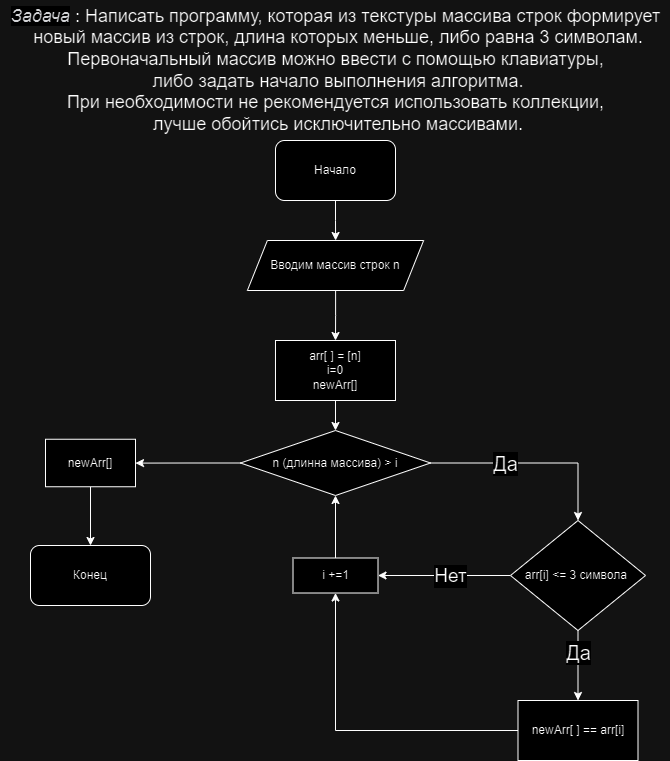

# verificationWork

Программа работает по принципу входящих данных с клавиатуры.
Сперва вводиться размер масива, потом происходит заполнение его разными строками.
Происходит обработка данных, на экран выводиться сперва массив строк,
который пользователь ввел в начале, а ниже отсортированный массив строк, 
у которого от 1-го до 3-ех символов. 

